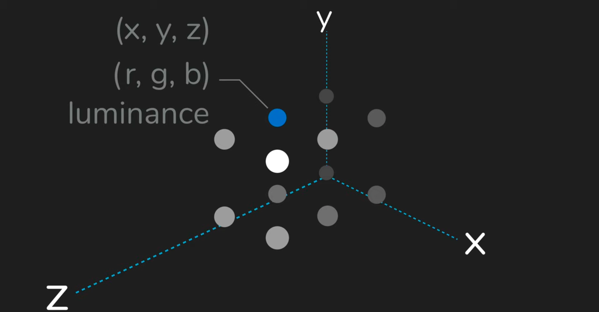

## Point Cloud 
* It is the simplest form of 3D model , It is a severel point of 3D plane

* Point cloud are created by performing a scan of object or structure
* Scan ar processed either by laser scanner or photogrammatry
* The primary purpose of this is to create a 3D model
